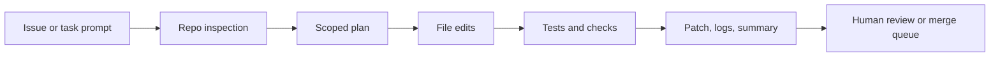

import SupportCTA from "/snippets/support-cta.mdx";

<SupportCTA />

## Summary

Coding agents help turn a software task into a bounded implementation loop:
inspect the repository, propose a change, edit the right files, run checks, and
hand back a diff with verification notes.

The current product signal is strong enough to treat this as a real agent shape,
not just autocomplete with a chat box. OpenAI's Codex positioning now spans a
cloud software-engineering agent plus a local terminal coding agent, which
makes the workflow legible for both teams and individual builders.

The newer lesson from this week's source window is that coding-agent quality is
not only about code generation. It is also about containment: where the agent
can read, what it can execute, which network paths it can reach, and how much
untrusted content can flow into its context before a user establishes trust.

## Why It Matters

Coding work has the right mix of structure and uncertainty for agents.

Useful, because the work is already artifact-heavy:

- issue text or bug report
- repository files
- tests and linters
- patch diffs
- review comments

Risky, because the agent can silently make the wrong edit, miss a failing test,
or overreach into unrelated files while still sounding confident.

That makes boundaries more important than raw generation quality. A useful
coding agent is a repo-scoped worker with explicit verification, not a generic
"write some code" assistant.

## Mental Model

A durable coding-agent workflow has five steps:

- `inspect`: read the issue, repo structure, and nearby code before changing anything
- `plan`: decide the smallest file set and validation path
- `change`: edit the scoped files and preserve unrelated local work
- `verify`: run tests, linters, or focused commands that check the claimed fix
- `handoff`: summarize the diff, remaining risks, and next reviewer focus

The key system boundary is not "can the model code?" It is whether the runtime
keeps the agent inside the intended repository, tool, and approval limits while
preserving a readable audit trail.

## Architecture Diagram

## Tool Landscape

Coding agents usually combine:

- repository read access for code, docs, and configuration
- file-edit tools that can produce an inspectable patch
- shell access for tests, formatters, builds, and git inspection
- browser or web access when a task depends on current docs or a running UI
- guardrails for approvals, network access, and destructive commands

OpenAI's current Codex surfaces make this split clearer than many earlier
coding assistants:

- the cloud Codex product frames software tasks as isolated runs with their own
  sandboxed environment and repository preload
- the open-source Codex CLI frames the local path as a terminal coding agent
  with approval modes, MCP access, web search, and cloud-task handoff

That is why coding agents should be taught as an end-to-end system loop, not as
just model output quality.

## Containment Boundaries

Recent first-party guidance makes the boundary design more explicit.

- `environment`: use sandboxes, VMs, filesystem boundaries, and egress controls
  to cap what the agent can reach
- `model`: use prompts, confirmations, and other safeguards to reduce risky
  behavior, but do not treat them as a complete defense
- `external content`: treat repositories, MCP servers, tool output, copied
  prompts, and fetched pages as untrusted inputs that can carry prompt
  injections

For coding agents, that means "approval-aware" is not enough on its own.
Current Anthropic engineering guidance frames containment as the hard cap on
blast radius across Claude.ai, Claude Code, and Cowork. OpenAI's current safety
guidance makes the same point from another angle: prompt injection is often
third-party content entering the agent's context, and the risk can include data
exfiltration or misaligned tool use. MCP security guidance adds the protocol
layer lesson that tool and scope grants should stay progressive and
least-privilege.

The practical takeaway is simple: evaluate a coding agent like a bounded
runtime, not just a model with shell access.

## Guardrails

Useful defaults for coding agents:

- start from repository inspection, not instant editing
- keep the write scope as small as possible
- keep secrets, host credentials, and unrelated folders outside the visible
  workspace whenever possible
- keep network access off by default and elevate it only for the specific task
  that needs it
- preserve unrelated working-tree changes
- require explicit verification before claiming completion
- keep command output, diffs, and test results visible to the reviewer
- treat secrets, production credentials, and destructive git commands as separate approvals
- treat repository content, project-local config, MCP tool output, and fetched
  web pages as untrusted until the boundary is established

If the environment supports both local and cloud execution, keep the trust
boundary explicit. Local execution can see the developer's real machine state.
Cloud execution is easier to isolate, but it still needs clear repo, secret, and
network policy.

## Tradeoffs

- More autonomy reduces copy-paste work, but it increases the risk of broad
  unintended edits.
- Local execution sees the real repository and environment, but it inherits more
  secrets and workstation risk.
- Cloud sandboxes isolate runs more cleanly, but they can drift from the exact
  local setup if dependencies or secrets differ.
- Better models can catch more uncertainty and flawed code, but they do not
  remove the need for containment when the agent can read untrusted content or
  call powerful tools.
- Fast patch generation feels productive, but a slower repo-inspect and verify
  loop usually produces better changes.

Practical default:

- use a local or cloud coding agent to inspect, patch, and verify
- keep a human in the review loop for merge decisions
- optimize for traceable diffs and reproducible checks instead of one-shot code generation

## Current Product Signal

The current seven-day signal for this handbook run was `coding agent
containment`, refined from stored article coverage around Anthropic's
containment write-up, Anthropic's Claude Opus 4.8 launch, and a current
prompt-injection incident aimed at coding workflows.

The reusable lesson is broader than one vendor:

- coding agents are becoming a distinct product category
- the winning shape is repository-first, verification-heavy, and approval-aware
- the next differentiation layer is containment: workspace-only writes, scoped
  network policy, controlled tool grants, and explicit treatment of untrusted
  content
- teams should evaluate them as agent systems with memory, tools, policies, and
  review artifacts, not as pure prompt UX

## Starter Direction

For a practical on-ramp, start with the existing
[Codex Desktop Agent Setup](/workshops/desktop-agents/codex) workshop. It is
the shortest path in this repo from installation to real repository work.

From there, connect this case study to:

- [Evaluation And Observability](/systems/evaluation-and-observability) for the
  verification and trace loop
- [Context Engineering](/systems/context-engineering) for instruction, state,
  and retrieval boundaries
- [Claude Code Desktop Agent Setup](/workshops/desktop-agents/claude-code) for
  a local coding-agent workflow that makes sandbox and approval choices visible
- [Local Agent Tooling Source Map](/contributor-kit/reference-notes/local-agent-tooling-source-map)
  for roots, resources, connectors, and file-grounded boundary design
- [Case Studies Overview](/case-studies) for adjacent product shapes such as
  deep research and customer support agents

## Citations

- Official source: [Introducing Codex](https://openai.com/index/introducing-codex/)
- Official source: [Codex CLI documentation](https://developers.openai.com/codex/cli)
- Official source: [How we contain Claude across products](https://www.anthropic.com/engineering/how-we-contain-claude)
- Official source: [Understanding prompt injections](https://openai.com/safety/prompt-injections/)
- Official source: [Safety in building agents](https://developers.openai.com/api/docs/guides/agent-builder-safety)
- Official source: [MCP security best practices](https://modelcontextprotocol.io/docs/tutorials/security/security_best_practices)
- High-signal repository: [openai/codex](https://github.com/openai/codex)
- High-signal repository: [modelcontextprotocol/modelcontextprotocol](https://github.com/modelcontextprotocol/modelcontextprotocol)
- High-signal repository: [anthropics/claude-code-action](https://github.com/anthropics/claude-code-action)

## Reading Extensions

- [Codex Desktop Agent Setup](/workshops/desktop-agents/codex)
- [Claude Code Desktop Agent Setup](/workshops/desktop-agents/claude-code)
- [Evaluation And Observability](/systems/evaluation-and-observability)
- [Context Engineering](/systems/context-engineering)
- [Local Agent Tooling Source Map](/contributor-kit/reference-notes/local-agent-tooling-source-map)
- [Case Studies Overview](/case-studies)

## Update Log

- 2026-05-31: Refreshed the case study around coding-agent containment
  boundaries, prompt-injection risk, and stronger source links across Codex,
  Claude Code, OpenAI safety guidance, and MCP security guidance.
- 2026-05-03: Added a repo-native coding-agents case study anchored in the
  current OpenAI Codex signal and linked it to the handbook's existing Codex
  workshop.
