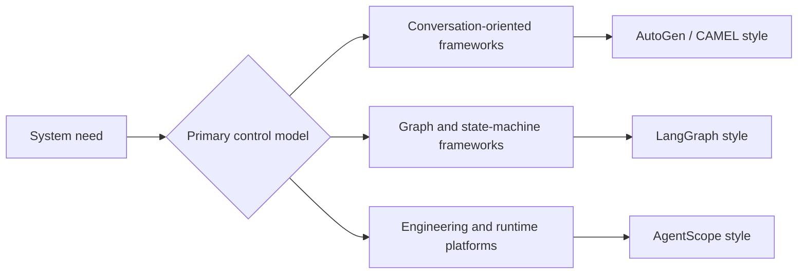

# Agent Frameworks

## Summary

Agent frameworks package recurring runtime problems such as state, tools,
message passing, and control flow. The right framework is not the one with the
most features. It is the one whose mental model matches the system you are
trying to build.

## Why It Matters

Teams usually reach for a framework after the first manual prototype starts to
hurt. The pain is familiar:

- duplicated agent loop code
- unclear state handling
- hard-to-reuse tools
- weak observability
- brittle multi-agent coordination

Frameworks matter because they turn those recurring problems into explicit
abstractions.

## Mental Model

The imported reference material highlights four useful comparison anchors:

- `AutoGen`: conversation-driven collaboration
- `AgentScope`: engineering-first multi-agent infrastructure
- `CAMEL`: role-playing collaboration with light orchestration
- `LangGraph`: graph-structured control flow and state management

These are not just product names. They represent different ways of thinking
about agent software.

- conversation-first frameworks model collaboration as dialogue
- graph-first frameworks model it as state transitions
- platform-style frameworks emphasize runtime infrastructure and deployment

## Architecture Diagram

## Tool Landscape

### Global coverage

- AutoGen is useful when the system should behave like a coordinated group of
  specialists exchanging messages.
- CAMEL is useful when role pairing and autonomous collaboration are more
  important than heavy orchestration.
- LangGraph is useful when explicit workflow control, loops, and recoverable
  state transitions matter more than emergent conversation.

### China-linked coverage

- AgentScope represents an engineering-first path with strong attention to
  large-scale multi-agent construction, message infrastructure, and production
  concerns.

### Selection criteria

- Choose conversation-first frameworks when collaborative behavior is the main
  abstraction.
- Choose graph-first frameworks when predictable control flow matters most.
- Choose platform-style frameworks when runtime, scale, and operational
  concerns are central from the beginning.

## Tradeoffs

- Conversation-oriented frameworks feel natural for collaboration, but they can
  be harder to debug and constrain.
- Graph-oriented frameworks are easier to reason about operationally, but they
  require more explicit design work upfront.
- Engineering-heavy frameworks help when production requirements arrive early,
  but they can be excessive for small prototypes.
- Lightweight role-play patterns are fast to try, but they may not scale cleanly
  to large coordination graphs.

Useful defaults:

- start from the control model, not from brand familiarity
- keep framework choice aligned with the product surface and team capability
- avoid importing distributed-system complexity into a project that is still
  validating basic task fit

## Citations

- Source input: [Chapter 6 Framework Development Practice](../references/hello-agents-main/docs/chapter6/Chapter6-Framework-Development-Practice.md)
- Source input: [Hello-Agents reference boundary](../references/README.md)

## Reading Extensions

- [Reasoning And Control Patterns](../patterns/reasoning-and-control-patterns.md)
- [Planning And Reflection](../patterns/planning-and-reflection.md)
- [Ecosystem Overview](./README.md)

## Update Log

- 2026-04-21: Initial repo-native draft based on imported reference material and handbook rewrite rules.
