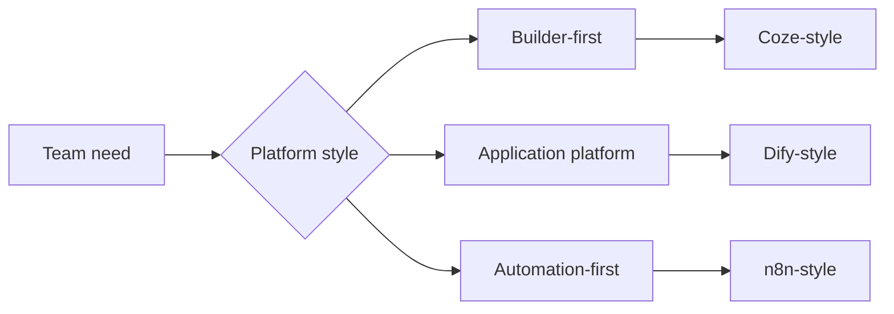

# Agent Platforms And Low-Code Builders

## Summary

Low-code agent platforms turn recurring application patterns into visual or
configuration-first building blocks. They matter when speed, accessibility, and
integration breadth are more important than owning every runtime detail in
code.

## Why It Matters

Not every useful agent needs to begin with a custom framework. Many teams first
need to validate a product surface, connect common services, or let non-engineer
stakeholders participate in building the workflow.

That is where low-code and platform-style builders become attractive.

## Mental Model

The imported source material points to three distinct platform shapes:

- `Coze`: agent-builder experience oriented around quick assembly, plugins, and
  publishing
- `Dify`: open-source application platform oriented around orchestration,
  plugins, knowledge, and deployment control
- `n8n`: automation-first workflow platform that can host agent logic inside a
  larger business process

These are different choices, not direct substitutes.

- builder-first products optimize fast creation and operator friendliness
- application platforms optimize broader product and deployment control
- automation platforms optimize integration into existing process chains

## Architecture Diagram

## Tool Landscape

### Global and China-linked coverage

- Coze and Dify illustrate strong China-linked platform ecosystems with broad
  builder reach and plugin-driven expansion.
- n8n illustrates the globally common automation-first pattern where AI is one
  step inside a larger workflow rather than the whole product surface.

### Selection criteria

- Choose builder-first platforms when quick iteration and cross-functional
  participation matter most.
- Choose application platforms when you need a stronger bridge between
  prototype, orchestration, and deployable product surfaces.
- Choose automation-first platforms when the agent must live inside an existing
  operational pipeline such as email, CRM, or internal ops tooling.

### Common platform strengths

- visual orchestration
- reusable components or plugins
- faster prototyping than writing everything from scratch
- easier handoff to non-specialist operators

## Tradeoffs

- Faster assembly usually means weaker fine-grained control than code.
- Visual platforms improve accessibility, but complex flows can still become
  hard to debug.
- Rich plugin ecosystems accelerate capability growth, but they also create
  dependency and trust questions.
- Built-in storage, memory, or retrieval layers may be convenient for prototypes
  but insufficient for production durability.

Useful defaults:

- use platforms to validate product fit quickly
- move to code only when the platform abstraction becomes the blocker
- separate prototype convenience from production requirements early

## Citations

- Source input: [Chapter 5 Building Agents with Low-Code Platforms](../references/hello-agents-main/docs/chapter5/Chapter5-Building-Agents-with-Low-Code-Platforms.md)
- Source input: [Extra03 Dify walkthrough](../references/hello-agents-main/Extra-Chapter/Extra03-Dify%E6%99%BA%E8%83%BD%E4%BD%93%E5%88%9B%E5%BB%BA%E4%BF%9D%E5%A7%86%E7%BA%A7%E6%93%8D%E4%BD%9C%E6%B5%81%E7%A8%8B.md)
- Source input: [n8n install guide](../references/hello-agents-main/Additional-Chapter/N8N_INSTALL_GUIDE.md)

## Reading Extensions

- [Agent Frameworks](./agent-frameworks.md)
- [Agents Vs Workflows](../foundations/agents-vs-workflows.md)
- [Ecosystem Overview](./README.md)

## Update Log

- 2026-04-21: Initial repo-native draft based on imported reference material and lab rewrite rules.
