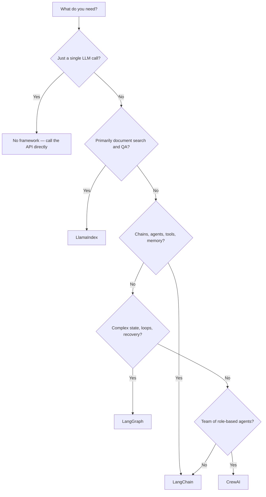
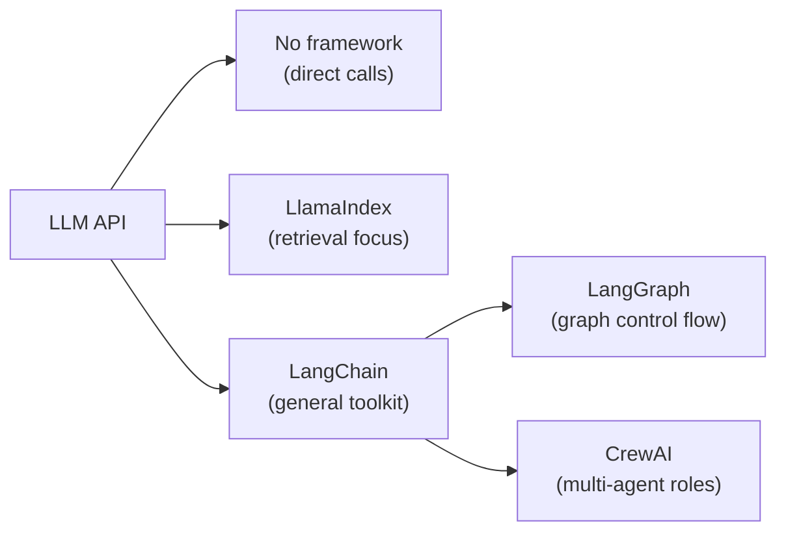

import SupportCTA from "/snippets/support-cta.mdx";

<SupportCTA />

## Summary

AI frameworks such as LangChain and LlamaIndex wrap common LLM plumbing —
prompt management, tool calling, memory, retrieval — so developers do not
rebuild the same wiring for every project. This page helps beginners decide
whether they need a framework at all, and if so, which one fits their problem.

## Why It Matters

Calling an LLM API directly is enough for a single prompt-and-response script.
The moment a project needs any of the following, the boilerplate starts to
compound:

- **conversation memory** across multiple turns
- **document retrieval** over a private knowledge base
- **tool use** such as web search or database queries
- **multi-step reasoning** where one LLM call feeds the next
- **multi-agent coordination** where several specialists collaborate

A framework absorbs that boilerplate. Without one, teams end up maintaining
hand-rolled versions of the same abstractions — and those hand-rolled versions
tend to drift, break, and resist testing.

The risk on the other side is **over-engineering**. Reaching for a heavy
framework when a ten-line script would do adds learning cost, dependency weight,
and debugging surface with no payoff. The right question is not "which framework
is best?" but "does my current pain justify adopting one?"

## Mental Model

Think of the spectrum of framework choices as different ways of building with **LEGO blocks and instructions**:

| Option | LEGO Analogy | What it means |
| --- | --- | --- |
| **No framework** | Raw plastic or random loose bricks without any instruction booklet | You call the LLM API directly. Full control, no pre-built abstractions, maximum flexibility — but you build every single connection and boundary logic yourself. |
| **LlamaIndex** | A specialized set designed to build a specific "bookshelf" or "storage cabinet" | Purpose-built with the exact pieces and an optimized manual for one core job: connecting LLMs to your private data (indexing, storage, and retrieval). Excellent for RAG, but less suited for general-purpose apps. |
| **LangChain** | A massive "LEGO Classic" bucket with a multi-purpose handbook | A general-purpose toolkit containing pre-made wheels, gears, baseplates, and templates (chains, agents, memory). You don't have to manufacture the blocks, but you still assemble them according to your needs. |

Two advanced extensions:

- **LangGraph** — Think of this as **LEGO Technic or Mindstorms**. It introduces gears, motors, and programmable hubs to build complex, moving machines with loops, state-saving, and branching logic (stateful graphs).
- **CrewAI** — A specialized **Role-Play LEGO set** (e.g., a space crew or police station) where each mini-figure has a pre-assigned role, goal, and backstory, and they work together to complete a specific mission.

The key insight: **you move up the stack only when the pain of not having the abstraction exceeds the cost of adopting it.**

## Architecture Diagram

A simplified view of where each option sits relative to the raw LLM API:

## Tool Landscape

### Comparison table

| Dimension | No framework | LlamaIndex | LangChain | LangGraph | CrewAI |
| --- | --- | --- | --- | --- | --- |
| **Purpose** | Direct LLM calls, full manual control | Document ingestion, indexing, and QA | General-purpose LLM application toolkit | Stateful, graph-based agent orchestration | Role-based multi-agent collaboration |
| **Complexity** | Minimal | Low–moderate | Moderate–high | High | Moderate |
| **Best for** | Scripts, demos, learning | RAG pipelines, knowledge bases | Chatbots, tool-using agents, chains | Complex workflows with loops and checkpoints | Scenarios that map to a team of specialists |
| **Learning curve** | None (just the API) | Small — focused API surface | Steeper — many abstractions | Steep — requires graph thinking | Moderate — role/task model is intuitive |
| **When to avoid** | Anything beyond a toy script | When retrieval is not the core problem | When a simple API call would suffice | When the workflow is linear | When you have a single agent |

### Scenario walkthroughs

#### Scenario 1 — Simple chatbot

- **No framework**: call the chat completion API, manage message history in a
  list, handle token limits manually. Works fine for a prototype.
- **LangChain**: use `ChatOpenAI` + `ConversationBufferMemory` to get memory
  management, prompt templates, and streaming out of the box.
- **Verdict**: start without a framework; switch to LangChain when memory
  management or tool use becomes painful.

#### Scenario 2 — Document QA over internal PDFs

- **No framework**: write your own PDF parser, chunk text, call an embedding
  API, store vectors, retrieve, and assemble the prompt. Significant effort.
- **LlamaIndex**: load documents with a built-in reader, create a vector index,
  and query. A few lines of code.
- **LangChain**: also possible via its retrieval chain abstractions, but
  requires more glue code than LlamaIndex for the same result.
- **Verdict**: LlamaIndex is the natural fit when retrieval is the core job.

#### Scenario 3 — Multi-agent research workflow

- **LangGraph**: define a graph where a planner node delegates to researcher and
  writer nodes, with conditional edges and checkpointing.
- **CrewAI**: define agents with roles (researcher, writer, editor) and tasks,
  let the framework handle delegation.
- **Verdict**: both work; CrewAI is faster to prototype, LangGraph gives more
  control over execution flow.

## Tradeoffs

- **No framework** gives full control but scales poorly. Every new feature means
  more hand-rolled code.
- **LlamaIndex** excels at retrieval but is not a general agent framework. If
  you need tools, memory, or multi-step chains beyond RAG, you will outgrow it.
- **LangChain** covers the widest surface but its abstraction depth can make
  debugging harder and upgrades more expensive.
- **LangGraph** adds power for complex state machines but introduces graph
  concepts that are overkill for linear workflows.
- **CrewAI** makes multi-agent setups intuitive but hides orchestration details,
  which can be limiting for custom control flow.

Useful defaults:

- Start with no framework. Move up only when the pain is real.
- Choose LlamaIndex when the problem is "search my documents."
- Choose LangChain when the problem is "build an agent that uses tools."
- Choose LangGraph or CrewAI when the problem involves coordinated multi-step
  or multi-agent work.
- If the task is deterministic, use a plain function or workflow — not an agent.

## Citations

- [LangChain documentation](https://python.langchain.com/)
- [LlamaIndex documentation](https://docs.llamaindex.ai/)
- [LangGraph documentation](https://langchain-ai.github.io/langgraph/)
- [CrewAI documentation](https://docs.crewai.com/)
- Current official readings are listed in `external_readings`.

## Reading Extensions

- [Agent Frameworks](/ecosystem/agent-frameworks): intermediate-level comparison
  of conversation-first, graph-first, skill-first, and engineering-first
  frameworks.
- [Agent Runtime Building Blocks](/patterns/agent-runtime-building-blocks):
  the runtime primitives that frameworks wrap.
- [Ecosystem Overview](/ecosystem): the full ecosystem lane.

## Update Log

- 2026-05-04: Initial draft for beginner-oriented framework comparison.
