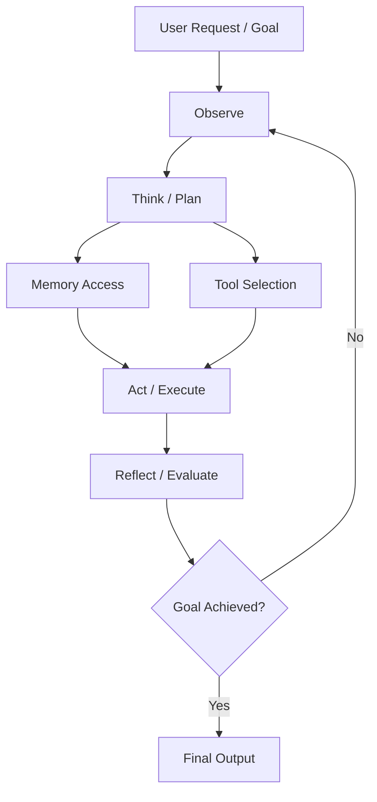

import SupportCTA from "/snippets/support-cta.mdx";

<SupportCTA />

## Summary

An agent is a goal-oriented system that continuously perceives its environment, makes decisions, and takes actions to achieve desired outcomes. Rather than being a static model, an agent operates as an ongoing loop—observing, reasoning, and acting in a dynamic cycle that adapts to changing conditions. In this section, you will learn how agents differ from standalone models, how this perception–decision–action loop forms the core of intelligent behavior, and how such systems are designed and applied in real-world scenarios.

## Why It Matters

Traditional programs and standalone models are inherently limited: they execute predefined logic or produce one-off outputs without the ability to adapt, persist, or pursue goals over time. Agents matter because they transform static computation into **continuous, goal-driven behavior**.

Autonomy reduces the need for constant human intervention, allowing systems to operate independently in dynamic environments. Tool use extends capability beyond the limits of a single model, enabling interaction with external systems, data sources, and real-world actions. Most importantly, the looped nature of agents—continuously observing, reasoning, and acting—makes it possible to handle complex, multi-step tasks that cannot be solved in a single pass.

In essence, agents represent a shift from “execution” to “behavior”: from systems that respond once, to systems that **act, adapt, and improve over time**. Understanding this shift is key to building intelligent systems that are practical, scalable, and aligned with real-world complexity.

## Mental Model

At the core of an agent lies a **closed-loop decision system**, not a one-time computation. Instead of a simple linear pipeline, agents operate through a continuous cycle:

**Observe → Think → Act → Reflect → Loop**

* **Observe**: The agent perceives its environment through inputs such as user queries, sensor data, or external signals.
* **Think**: It reasons over the observed information using models (e.g., LLMs), rules, or planning strategies to decide what to do next.
* **Act**: The agent executes actions—calling tools, generating outputs, or interacting with the environment.
* **Reflect**: It evaluates the results of its actions, incorporating feedback, errors, or new information to adjust future behavior.

This cycle then repeats, forming a **self-correcting and adaptive loop**.

Crucially, an agent is not defined by a single decision or response, but by this ongoing process. Its intelligence emerges from the ability to iteratively refine its actions over time. In other words, an agent is fundamentally a **continuously running closed-loop system**, rather than a one-off function call.

---

### Example: Daily News Watcher

Consider a daily news watcher agent that generates a news digest:

* **Observe**: The agent receives a request (e.g., “summarize the latest AI news”) and fetches articles from a set of sources
* **Think**: It decides which articles are relevant, filters by topic, and determines how to organize the content
* **Act**: It retrieves, parses, and summarizes the selected articles into a structured report
* **Reflect**: It evaluates whether the result is complete and coherent, and adjusts if necessary

This process forms a loop, where the agent continuously refines its output based on intermediate results.

---

### How this differs from a traditional script

Although the workflow may look similar to a scripted pipeline, an agent behaves fundamentally differently:

* **Dynamic decision-making**
  A traditional script follows a fixed sequence of steps.
  An agent decides what to do at each step based on intermediate results (e.g., which articles to keep, how to summarize them).

* **Context-aware reasoning**
  Scripts operate on predefined rules.
  Agents interpret inputs (like “latest AI news”) and adapt their behavior accordingly.

* **Flexible control flow**
  Scripts have a static control flow.
  Agents can loop, revise, or branch depending on outcomes (e.g., re-fetch or re-summarize if results are insufficient).

* **Integration of language intelligence**
  Scripts process structured data deterministically.
  Agents use models to handle unstructured data such as text, enabling summarization, filtering, and reasoning.

## Architecture Diagram

## Tool Landscape

Modern agents are not built as a single model, but as multi-component systems that combine reasoning, action, and memory into a cohesive whole. This modular design is what enables agents to move beyond simple responses and handle complex, real-world tasks.
* **LLM (Reasoning Core)**: decides what to do by interpreting inputs and generating plans
* **Tools (Action Layer)**: extend capabilities by enabling interaction with external systems and execution of actions
* **Memory (Context Layer)**: provides continuity across steps, supporting context retention and adaptation
* **Frameworks (Orchestration Layer)**: organize and coordinate components into a working system (e.g., LangChain, AutoGen)

A useful mental model is to think of the LLM as the “brain” and tools as the “limbs.” Extending this analogy, the backend system acts like a nervous system: it does not perform biological signal transmission, but instead parses model outputs, maps them into structured function calls, and routes them through program logic to trigger tool execution. This layer is what enables the transition from decision to action, turning abstract reasoning into concrete operations.

In essence, a modern agent is not just a model—it is a coordinated system of components, where intelligence emerges from the interaction between reasoning, tools, memory, and control logic.
## Tradeoffs

While agents unlock powerful capabilities, these features come with important tradeoffs.

* **Cost of the loop (latency / tokens / complexity)**:
  Continuous observe–think–act cycles introduce additional latency and higher token usage. Multi-step reasoning, retries, and reflection increase system complexity, making performance optimization and cost control more challenging.

* **Risk of autonomy (incorrect or unintended actions)**:
  Greater autonomy means the agent can act without constant human oversight, but this also introduces the risk of wrong decisions, unsafe actions, or misinterpretation of goals—especially in open-ended environments.

* **Tool dependency (system reliability)**:
  Agents rely on external tools and APIs to act. Failures in these dependencies—such as API errors, latency spikes, or inconsistent outputs—can directly impact the agent’s behavior and overall system stability.

In essence, the same properties that make agents powerful—looping, autonomy, and tool use—also introduce **cost, risk, and engineering challenges** that must be carefully managed in real-world systems.

## Citations

- Wooldridge, M., & Jennings, N. R. (1995). Intelligent Agents: Theory and Practice
- Xi, Z., Chen, W., Guo, X., et al. (2023). The Rise and Potential of Large Language Model Based Agents

## Reading Extensions

- Learn Next: [Chapter 1.3 what is agent system?](/foundations/agent-systems/what-is-agent-system)
- [Agents Vs Workflows](/foundations/agents-vs-workflows)
- [Agent Memory And Retrieval](/patterns/agent-memory-and-retrieval)
- [Foundations Overview](/foundations)

## Update Log

- 2026-04-20: Initial scaffold.
- 2026-05-04: Completed core content, including definition, mental model, tool landscape, tradeoffs, examples, and citations
