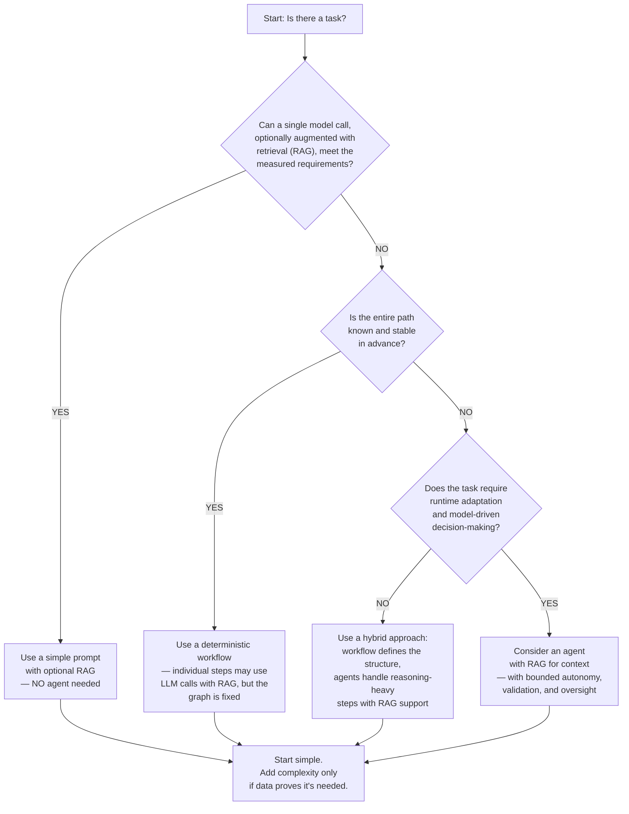

import SupportCTA from "/snippets/support-cta.mdx";

<SupportCTA />

## Summary

While modern AI agents are powerful, many practitioners default to using them for every single AI tasks, leading to many different risks and issues. This page will be focused in highlighting scenarios where agents should not be used.

## Why It Matters 

Many product and engineering mistakes comes from using the wrong tool for the job. When teams default to agents without evaluating whether they're needed, they face: 
  - **Over-engineered solution** that are harder to maintain than necessary
  - **Unpredictable Cost** from multi-step LLM calls that could've been avoided
  - **Unreliable behavior** in scenarios where determinism is required 
  - **Team friction** when agents are introduced into contexts that don't actually benefit from autonomy 

Choosing an agents when a simpler approach would work is often more damaging than choosing the wrong model. 

## Mental Model

The core technical distinction is well established: **workflow** orchestrate LLMs and tools through predefined code paths, while **agents** let the LLM dynamically decide what to do next at runtime.

The handbook already covers this choice in detail on the **Agents Vs Workflows** page. **This page does not rehash that debate.** Instead, it acts as a **pre-filter**. 

Before you even ask *"Should I use a workflow or an agent?"*, you must first determine whether this task require run-time decision-making and adaptation. 

If the answer is no, the workflow-vs-agent debate is premature. Default to the simplest solution—a single prompt, a deterministic script, or a traditional pipeline.

Use this framework to quickly assess your situation:

| Dimension | Use a Simpler Approach | Consider an Agent |
|---|---|---|
| **Path** | Fully known in advance | Unknown or changes dynamically |
| **Rules** | Stable and predictable | Ambiguous or context-dependent |
| **Cost tolerance** | Low (budget-conscious) | Higher (value justifies cost) |
| **Latency tolerance** | Low (real-time needed) | Higher (seconds/minutes acceptable) |
| **Verification and Control** | Outputs used directly without review. Deterministic and predictable. | Requires human-in-the-loop, deterministic validation layers, or both before acting on outputs |
| **Evaluation** | Easy to define and measure | Harder to define and measure |

If most checks fall on the left side, don't use an agent.

### A Note on High-Stakes Scenarios

This framework does **not** categorically ban agents from high-stakes work. Industry guidance from OpenAI and Google Cloud emphasizes:

- **Bounded autonomy** — Limit the agent's scope, tool access, and decision-making power.
- **Human-in-the-loop** — Require human approval for critical actions (e.g., approving a refund, executing a financial transaction).
- **Deterministic validation layers** — Enforce rules, type checks, or business logic to validate agent outputs before any authoritative action is taken.

For example, an agent can analyze a patient's symptoms and suggest potential diagnoses, but the final prescription should always be reviewed by a human doctor. The agent assists; the human authorizes.

## Scenarios where you should NOT use an agent 

**1. Simple tasks that a single prompt can solve**
  - Example: Summarizing a customer support ticket 

**2. Deterministic Business Logic**
  - Example: Monthly invoice generation

**3. Real-time or Low-latency applications** 
  - Example: A search bar that suggests results as the user types. Agents would be too slow

**4. Cost-sensitive environments**
  - Example: A high-volume data processing pipeline processing 10M records daily. An agentic approach may be financially unsustainable if each record requires multiple LLM calls with expensive models and no caching

**5. High-stakes/100% Accuracy Scenarios**
  - Example: Calculating tax withholdings. There is no room for an agent to "decide" the wrong number.

**6. No clear evaluation metrics**
  - If you can't define how to measure success — no test set, clear criteria, or comparison method — you're building blindly. Agent development without evals is a recipe for unpredictable behavior and wasted effort.

  **This is a readiness problem, not a categorical ban on agents.** Before launching any production system define what "good" looks like. Start with a small dataset, define a rubric, and run evaluation iteratively. Scale       only when you can reliably measure success.

**7. Limited engineering resources**
  - Example: A small startup's first AI feature. Start with a prompt; add an agent later if needed.

## Architecture Diagram 

## Tradeoffs

The choice between using and not using an agent involves four core tradeoffs: 
  - **Simplicity VS Adaptability**: Simpler solutions are easier to build and maintain, but agents adapt better to changing contexts. Workflows are easier to test and audit, but they are expensive to maintain when edge cases keep growing. 
  - **Cost VS Capability**: The added capability must justify the added expense.
  - **Latency & Cost VS Task performance**: Agentic systems trade latency and cost for potentially better task performance — but performance isn't guaranteed by the agent pattern alone. Capability comes from the model,        tools, context, instructions, and evaluation harness. Each additional turn adds latency, each tool call adds cost, and errors can compound across steps.
  - **Predictability VS Flexibility**: Deterministic code is auditable and predictable. Agents are more flexible but harder to test and certify.

**Useful Defaults:**
  - Default to simple prompts and scripts for deterministic business policy, audit-heavy paths, and anything that requires 100% accuracy. 
  - Default to agents only for bounded exploration and judgement--and only after you've proven that simpler approaches can't solve the problem. 
  - When in doubt, start simple. Build a basic prompt or workflow first, then monitor it in production. Only add agentic production when you have clear evidence that the problem geniunely requires runtime adaptation. 

## Reading Extensions

- [Evaluation and Observability](/foundations/systems/evaluation-and-observability)
- [Foundations Overview](/foundations)
- [Agents Vs Workflow](/foundations/agents-vs-workflows)
- [Context Engineering](/systems/context-engineering)

## Update log
- 2026-07-19: Initial draft based on identified gap in the handbook's decision framework
