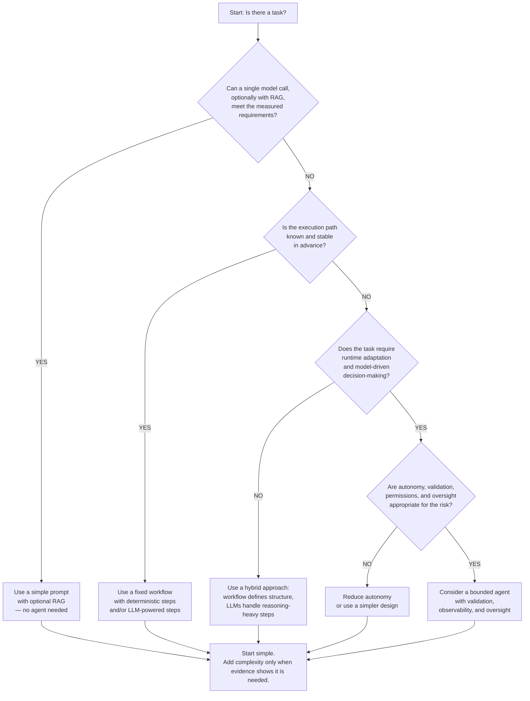

import SupportCTA from "/snippets/support-cta.mdx";

<SupportCTA />

## Summary

Modern AI agents are powerful, but they are not the right default for every AI task. An agent adds runtime decision-making, tool use, state, and potentially multiple model calls. If a simpler approach already meets the requirements, adding an agent usually adds unnecessary complexity, cost, latency, and failure modes.

The default should be simple: start with a single model call, retrieval-augmented generation (RAG), deterministic code, or a fixed workflow. Add agentic behavior only when the task genuinely requires runtime adaptation or model-driven decisions.

## Why It Matters

Many product and engineering mistakes come from using a more complex architecture than the problem requires. When teams default to agents without first establishing the requirements, they can introduce:

* **Unnecessary complexity** — more components, state, tools, and failure modes to maintain.
* **Unpredictable cost** — multi-step reasoning and tool calls can cost more than a simpler implementation.
* **Higher latency** — additional model calls and tool executions add time.
* **Less predictable behavior** — runtime decisions are harder to test and audit than fixed execution paths.
* **Operational friction** — agents require stronger observability, evaluation, permissions, and failure handling.

Choosing an agent when a simpler approach would work is often more damaging than choosing a less capable model.

## Mental Model

The core technical distinction is simple:

* **Workflows** orchestrate models and tools through predefined execution paths.
* **Agents** allow the model to dynamically decide what to do next at runtime.

The handbook already covers this distinction in **Agents Vs Workflows**. This page serves as a pre-filter.

Before asking *"Should I use a workflow or an agent?"*, first ask whether the task actually requires runtime decision-making and adaptation.

If the answer is no, start with the simplest solution that satisfies the measured requirements: a single model call, RAG, deterministic code, or a fixed workflow.

Use this framework to assess the situation:

| Dimension                    | Prefer a simpler approach              | Consider an agent                                                    |
| ---------------------------- | -------------------------------------- | -------------------------------------------------------------------- |
| **Path**                     | Fully known in advance                 | Unknown or changes dynamically                                       |
| **Rules**                    | Stable and predictable                 | Ambiguous or context-dependent                                       |
| **Cost tolerance**           | Low                                    | Higher cost is justified by additional capability                    |
| **Latency tolerance**        | Low                                    | Seconds or longer are acceptable                                     |
| **Verification and control** | Deterministic validation is sufficient | Runtime decisions need bounded autonomy, validation, or human review |
| **Evaluation** | Easy to define and measure | Measurable through task-level evaluation and operational telemetry                             |

If most checks fall on the left side, do not use an agent.

## High-Stakes Work: Separate Assistance From Authorization

High-stakes work needs a more precise rule than simply saying *"never use agents."*

There are two different problems:

1. **Deterministic execution or policy enforcement** — where the system must produce an authoritative result according to fixed rules.
2. **High-stakes assistance** — where an AI system can help analyze information, summarize evidence, identify possibilities, or prepare a proposed action, while a deterministic control or authorized human remains responsible for the consequential decision.

For the first category, prefer deterministic software. For example, tax withholding calculations, eligibility rules, limits, or policy enforcement should be implemented and validated as explicit business logic rather than delegated to an agent.

For the second category, an agent may assist when its autonomy is tightly bounded. A high-stakes agentic system should generally:

* restrict the agent's tools, permissions, and operating scope;
* validate outputs with deterministic rules where possible;
* log and monitor important actions;
* pause at defined checkpoints;
* require human authorization before critical or irreversible actions.

OpenAI recommends human intervention for high-risk actions such as payments or large refunds and recommends layered guardrails, including rules-based protections and output validation. Google Cloud similarly describes human-in-the-loop checkpoints for critical actions such as large financial transactions and sensitive-data release.

The important distinction is:

> **An agent can assist with a high-stakes task without being authorized to make the final high-stakes decision.**

For example, an AI system could analyze a patient's information and prepare a structured summary for a clinician. That does not mean the system should autonomously prescribe treatment. The agent assists; the authorized human makes the consequential decision.

## Scenarios Where You Should Not Use an Agent

### 1. Simple tasks that a single model call can solve

If the task can be completed reliably with one model call, an agent loop may add complexity without meaningful benefit.

**Example:** summarizing a customer-support ticket.

Start with a prompt and, if necessary, retrieval or structured output.

### 2. Deterministic business logic

When the correct behavior is defined by explicit rules, use deterministic software.

**Examples:**

* calculating tax withholdings;
* applying eligibility rules;
* enforcing spending limits;
* calculating prices or totals;
* validating required fields.

The model can assist with explanation or unstructured input, but the authoritative calculation or policy decision should remain in deterministic code.

### 3. Real-time or low-latency applications

Agent loops can introduce additional model calls and tool executions that are unnecessary when the user expects an immediate response.

**Example:** a search box suggesting results while the user types.

A lightweight retrieval, ranking, or classification system is usually a better fit.

### 4. Cost-sensitive environments

If the workload operates at very high volume, even a small increase in per-task cost can become significant.

**Example:** processing 10 million records per day.

If each record requires multiple model calls and tool executions, the economics may not justify an agent. Benchmark the simpler solution first and use caching, batching, smaller models, or deterministic processing where appropriate.

### 5. Tasks where authoritative correctness comes from fixed rules

Some tasks are not merely "high stakes"; their required behavior is explicitly defined and must be applied consistently.

In these cases, do not delegate the authoritative decision to an agent.

Use deterministic policy enforcement and validation instead. An LLM or agent can still assist with tasks such as extracting information, explaining a rule, or preparing a recommendation, provided its output does not bypass the authoritative control.

### 6. No meaningful evaluation strategy

If you cannot define what success means, you cannot reliably determine whether adding agentic complexity improved the system.

Before deploying an agent, establish measurable criteria such as:

* task success rate;
* factual or retrieval quality;
* tool-selection accuracy;
* latency;
* cost per task;
* failure rate;
* escalation rate.

Evaluation tools such as Ragas and LangSmith support dataset-based evaluation, while LangSmith and Langfuse provide mechanisms for tracing and monitoring application behavior.

This is a **readiness problem, not a categorical ban on agents**. Start with a small evaluation set, define a rubric, measure the baseline, and only add agentic complexity when the evidence shows that runtime adaptation provides meaningful value.

### 7. Limited engineering or operational resources

Agents require more than an API call. Production systems may need evaluation, tracing, permission boundaries, retries, failure handling, and human escalation.

**Example:** a small team building its first AI feature.

Start with a prompt or fixed workflow. Add agentic behavior later if real usage demonstrates that the simpler architecture is insufficient.

## Architecture Diagram

## Tool Landscape

### Validate Before You Build

Before investing in an agent, establish whether the simpler solution already meets the requirements.

1. **Establish a baseline** — Use an evaluation framework such as Ragas or LangSmith to measure the current solution. Useful metrics can include correctness, faithfulness, answer relevance, cost, and latency.

2. **Trace and monitor** — Use an observability platform such as LangSmith, Langfuse, or AgentOps to understand how the current system behaves in development and production. Track latency, cost, errors, tool calls, and other relevant execution data.

3. **Compare against the baseline** — If the simpler solution already meets the requirements, do not add an agent. If there is a measurable gap that runtime adaptation can plausibly address, test a bounded agentic design.

The goal is not to use the most sophisticated architecture. The goal is to use the **least complex architecture that reliably meets the requirements**.

## Tradeoffs

The choice between using and not using an agent involves several core tradeoffs:

* **Simplicity vs. adaptability** — Simpler systems are easier to build, test, and maintain. Agents adapt better when the path cannot be fully specified in advance.
* **Cost vs. capability** — Additional model calls and tool use must provide enough value to justify their cost.
* **Latency vs. task performance** — Agentic systems may improve performance on complex tasks but often require additional inference and tool calls.
* **Predictability vs. flexibility** — Deterministic code is easier to audit and reason about. Agents provide flexibility but introduce more runtime variability.
* **Autonomy vs. control** — More autonomy can reduce manual work, but high-impact actions require stronger permissions, validation, and human oversight.

Agents are not automatically better than workflows. The right architecture depends on what the task actually requires.

## Useful Defaults

* Default to **simple prompts, RAG, deterministic code, and fixed workflows** when they meet the requirements.
* Use **deterministic business logic** for calculations, policy enforcement, limits, and other authoritative rules.
* Use **bounded agentic assistance** for complex or ambiguous work when runtime adaptation provides measurable value.
* For high-stakes actions, separate **analysis from authorization** and require deterministic validation and/or human approval where appropriate.
* Establish evaluation and observability before scaling agentic behavior.
* Start with the smallest viable architecture and add autonomy only when evidence shows that it is needed.

When in doubt, start simple. Build a baseline, measure it, and add agentic behavior only when the problem genuinely requires runtime adaptation.

## Citations

* [OpenAI, *A practical guide to building agents*](https://openai.com/business/guides-and-resources/a-practical-guide-to-building-ai-agents/) — agent selection, guardrails, tool safeguards, output validation, and human intervention.
* [Anthropic, *Building Effective Agents*](https://www.anthropic.com/engineering/building-effective-agents) — workflows versus agents and choosing the simplest solution that meets the requirements.
* [Google Cloud, *Choose a design pattern for your agentic AI system*](https://docs.cloud.google.com/architecture/choose-design-pattern-agentic-ai-system) — non-agentic alternatives for predictable workloads and human-in-the-loop patterns for high-stakes or critical actions.
* [Microsoft, *Workflows*](https://learn.microsoft.com/en-us/agent-framework/journey/workflows) — explicit execution paths and workflow orchestration.
* [Ragas, *Evaluation*](https://docs.ragas.io/en/latest/references/evaluate/) — dataset-based evaluation and evaluation metrics.
* [LangSmith, *Evaluation*](https://docs.langchain.com/langsmith/evaluation) — offline and online evaluation workflows.
* [LangSmith, *Observability*](https://docs.langchain.com/langsmith/observability) — tracing and monitoring LLM applications.
* [Langfuse, *Observability*](https://langfuse.com/docs/observability/overview) — tracing model calls, tools, retrieval, latency, and cost.
* [AgentOps, *Introduction*](https://docs.agentops.ai/v2/introduction) — testing, debugging, deployment, and observability for AI agents and LLM applications.

## Reading Extensions

* [Evaluation and Observability](/systems/evaluation-and-observability)
* [Foundations Overview](/foundations)
* [Agents Vs Workflow](/foundations/agents-vs-workflows)
* [Context Engineering](/systems/context-engineering)

## Update Log

* 2026-07-19: Initial draft based on an identified gap in the handbook's decision framework.
* 2026-09-04: Revised decision framework, clarified deterministic versus high-stakes agentic use cases, added primary-source citations, aligned external readings, and completed copyediting.

---
