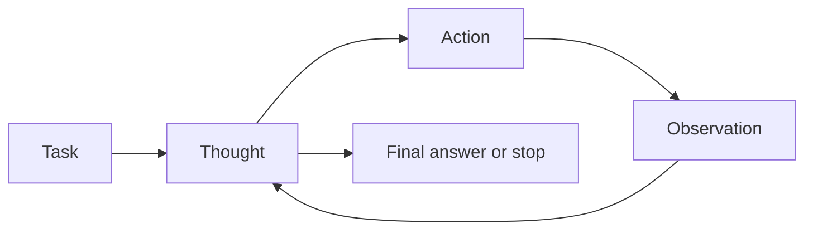

import SupportCTA from "/snippets/support-cta.mdx";

<SupportCTA />

## Summary

Reasoning and control patterns define how an agent alternates between thinking,
acting, and stopping. They are less about model intelligence than about how the
system structures decisions over time. That structure now spans more than one
loop shape: a single-session tool loop, a lead session that delegates side
tasks to subagents, and multi-agent orchestration where multiple specialists
coordinate in parallel.

## Why It Matters

Two agents with access to the same model and tools can behave very differently
depending on control pattern. One may search effectively, another may loop,
hallucinate, or call the wrong tool at the wrong time.

Pattern choice therefore shapes:

- action quality
- explainability
- cost and latency
- recovery behavior
- how much coordination overhead the system can justify

## Mental Model

The imported reference material uses ReAct as the clearest baseline. Its core
idea is simple:

- think about the current state
- take one action
- observe the result
- repeat

That design is powerful because reasoning and action correct one another. It is
especially useful when the system needs outside information or tool execution
before it can continue.

The broader lesson is that control patterns define where reasoning happens:

- before action
- between actions
- after failure
- or at explicit stopping points

That same lesson extends to orchestration. The system also has to decide where
coordination happens:

- inside one agent loop
- through delegated side workers that report back to a lead
- or across multiple independent agents that coordinate directly

## Architecture Diagram

## Choosing A Control Surface

Recent Anthropic guidance makes the control-surface choice more explicit:

| If the work looks like... | Prefer... | Because... |
| --- | --- | --- |
| One sequence of tool calls where each result changes the next step | single-session loop | the control logic stays cheapest and easiest to debug |
| A focused side task that would flood the main context with logs, search results, or file reads | subagent delegation | the lead keeps control while the worker returns only the summary |
| Parallel investigation across independent specialties | multi-agent orchestration | specialized workers can pursue different directions at the same time |
| Work that depends on direct worker-to-worker discussion and shared ownership | agent teams or collaborative multi-agent patterns | the workers need more than one-way reporting to a lead |

The control question is not only "how smart is the model?" It is also "how
expensive is coordination compared with the value of parallelism or
specialization?"

## Tool Landscape

Common reasoning and control patterns include:

- stepwise think-act-observe loops for open-ended tool use
- guarded tool selection where actions are constrained by narrow interfaces
- explicit stop or handoff rules that prevent endless loops
- traceable reasoning surfaces that expose enough intermediate state to debug
  decisions without forcing every token into the final answer
- hierarchical orchestration where a supervisor, router, or orchestrator
  delegates tasks to role-specific specialists
- collaborative multi-agent patterns where workers communicate directly or
  coordinate through shared state instead of routing everything through one lead

The important design choice is not whether to show chain-of-thought. It is
whether the system has enough internal control structure to keep actions
purposeful and recover when evidence changes.

Anthropic's current control-surface split is especially useful in practice:

- `subagents` fit focused side work inside one session. They keep their own
  context window, but they report back only to the main agent.
- `agent teams` fit more expensive collaborative work where independent
  sessions need direct communication, a shared task list, and explicit
  coordination.
- `multi-agent orchestration` is the broader architecture category around those
  ideas: centralized supervisor patterns, decentralized peer coordination, and
  structured workflows that mix both.

## Tradeoffs

- Stepwise loops are adaptable, but they are slower than direct execution and
  can drift without strong stopping conditions.
- Highly interpretable control surfaces make debugging easier, but they can
  feel verbose and expensive.
- Narrow tool surfaces reduce mistakes, but they can also limit flexibility.
- Rich intermediate reasoning can improve decisions, but only if the system can
  keep that reasoning aligned with the actual task.
- Multi-agent orchestration can improve coverage and specialization, but token,
  latency, and observability costs rise quickly.
- Collaborative worker teams are useful only when the task is genuinely
  parallel. For sequential work or same-file edits, coordination overhead can
  dominate the benefit.

Useful defaults:

- prefer stepwise control when tool feedback changes the next best action
- add explicit stop conditions before adding more tool breadth
- keep the control loop inspectable enough to debug, even if the final product
  hides most of that internal machinery
- use subagents before agent teams when one lead can still own the task and
  only needs focused side results
- use multi-agent orchestration only when specialization or parallel pursuit
  clearly beats a simpler single-loop design

## Citations

- Source input: [Chapter 4 Building Classic Agent Paradigms](https://github.com/datawhalechina/Hello-Agents/blob/main/docs/chapter4/Chapter4-Building-Classic-Agent-Paradigms.md)
- Source input: [Hello-Agents upstream repository](https://github.com/datawhalechina/Hello-Agents)
- Official source: [Anthropic: Building Effective AI Agents](https://resources.anthropic.com/hubfs/Building%20Effective%20AI%20Agents-%20Architecture%20Patterns%20and%20Implementation%20Frameworks.pdf)
- Official source: [Claude Code subagents](https://code.claude.com/docs/en/sub-agents)
- Official source: [Claude Code agent teams](https://code.claude.com/docs/en/agent-teams)

## Reading Extensions

- [Planning And Reflection](/patterns/planning-and-reflection)
- [Protocols And Interoperability](/systems/protocols-and-interoperability)
- [Patterns Overview](/patterns)

## Update Log

- 2026-05-07: Added current Anthropic guidance for subagents, agent teams, and
  multi-agent orchestration as concrete control-surface choices.
- 2026-04-21: Initial repo-native draft based on imported reference material and lab rewrite rules.
