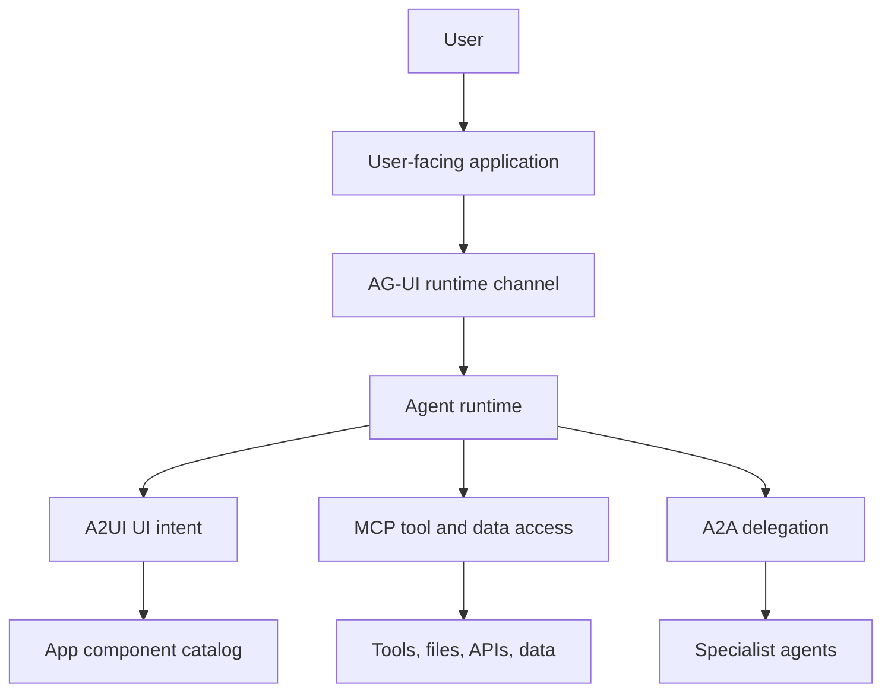

import SupportCTA from "/snippets/support-cta.mdx";

<SupportCTA />

## Summary

User-facing agents need an interface contract in addition to tool and
agent-to-agent contracts. `AG-UI` defines the event-driven runtime connection
between an agentic backend and an application. `A2UI` defines how an agent can
declare portable UI intent against an existing component catalog.

The practical point is simple: do not force UI interaction into `MCP` or
`A2A`. Treat the user-facing surface as its own system boundary.

## Why It Matters

Chatboxes are a weak default for many agentic products. Real applications often
need:

- streaming status while long tasks run
- typed frontend actions and approvals
- shared state between the app and the agent
- widgets, forms, charts, or editors that stay under application control

That is a different job from tool access or inter-agent delegation.

When teams skip this distinction, they usually end up with one of two bad
outcomes:

- a tool protocol is overloaded with UI concerns it was not designed to carry
- a frontend grows a pile of ad hoc event wiring that becomes hard to debug

## Mental Model

The current signal is cleaner than that:

- `AG-UI`: the runtime interaction layer between a user-facing application and
  an agentic backend
- `A2UI`: the UI-intent layer for portable generative widgets
- `MCP`: the tool and data access layer
- `A2A`: the inter-agent delegation layer

These layers can work together without collapsing into one protocol.

| If the question is... | Start with... | Because... |
| --- | --- | --- |
| How does the app stream messages, tool events, approvals, and shared state to and from an agent? | AG-UI | The boundary is live application runtime behavior. |
| How does the agent propose a portable widget or interface shape? | A2UI | The boundary is UI intent against an app-controlled component catalog. |
| How does the agent call tools or read external resources? | MCP | The boundary is capability access. |
| How does one agent hand work to another agent-like service? | A2A | The boundary is delegation and collaboration. |

Useful default:

- use `AG-UI` when the product embeds an agent inside an application
- add `A2UI` when portable widget declarations matter across clients or teams
- keep `MCP` and `A2A` focused on their own boundaries

## Architecture Diagram

The app still owns the rendered experience. The agent proposes, streams, or
coordinates. The application validates, mounts, and governs what the user
actually sees.

## Tool Landscape

AG-UI is useful when the interaction is stateful and eventful:

- token or event streaming
- long-running tasks that need progress updates
- frontend tool calls or approvals
- shared application state
- human-in-the-loop interrupts

A2UI is useful when the agent should describe UI in a portable way rather than
hardcoding a single frontend implementation.

That does not mean every agentic product needs both:

- use plain application-owned components when a stable workflow only needs a
  few known states
- use AG-UI when the agent must stay connected to a live product surface
- add A2UI only when declarative, portable UI intent creates real leverage

The design goal is controlled flexibility, not limitless UI generation.

## Tradeoffs

- More expressive UI protocols make products feel more native, but they add
  validation and governance work.
- A runtime channel improves traceability, but it introduces event schemas and
  lifecycle handling that simple request-response apps can avoid.
- Portable UI intent can reduce duplicate frontend wiring, but only if the
  component catalog stays disciplined.
- If the agent can mutate the interface too freely, debugging and trust get
  worse instead of better.

Strong defaults:

- keep the application in control of rendered components
- validate agent-proposed UI before mounting it
- separate UI state from tool permissions
- treat human approvals as first-class events, not special-case hacks

## Citations

- Official source: [A2UI v0.9: The New Standard for Portable, Framework-Agnostic Generative UI](https://developers.googleblog.com/a2ui-v0-9-generative-ui/)
- Official source: [AG-UI Overview](https://docs.ag-ui.com/introduction)
- Official source: [AG-UI Protocol](https://www.copilotkit.ai/ag-ui)
- High-signal repository: [ag-ui-protocol/ag-ui](https://github.com/ag-ui-protocol/ag-ui)
- High-signal repository: [CopilotKit/CopilotKit](https://github.com/CopilotKit/CopilotKit)

## Reading Extensions

- [Protocols And Interoperability](/systems/protocols-and-interoperability)
- [Evaluation And Observability](/systems/evaluation-and-observability)
- [Systems Overview](/systems)

## Update Log

- 2026-05-06: Added a repo-native systems page for AG-UI, A2UI, and the
  agent-to-UI boundary.
