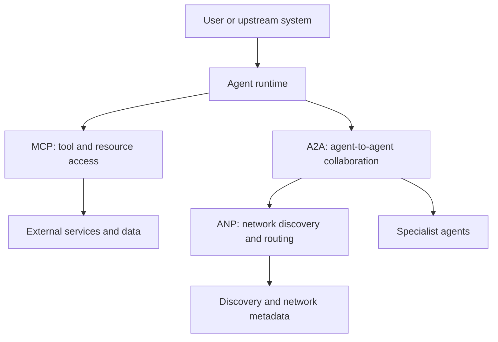

# Protocols And Interoperability

## Summary

Agent protocols are the interface contracts that let systems discover,
describe, and call capabilities beyond their own prompt loop. They matter when
tool access, agent collaboration, or network discovery need to scale beyond
one-off adapters.

## Why It Matters

A single agent can get surprisingly far with direct tool wrappers. The trouble
starts when the system needs to grow:

- multiple external services with inconsistent interfaces
- multiple agents with different roles
- multiple runtimes or organizations that need a shared contract

At that point, interoperability stops being a convenience and becomes a system
design problem.

## Mental Model

The three protocol families highlighted in the imported source material solve
different jobs:

- `MCP` standardizes how models and external tools or resources describe and
  expose capabilities.
- `A2A` standardizes how one agent delegates or collaborates with another
  agent-like service.
- `ANP` focuses on discovery and routing across larger agent networks.

The mistake is to treat them as interchangeable. They are better understood as
different layers:

- access layer: how a model reaches capabilities
- collaboration layer: how specialized actors coordinate
- network layer: how those actors are found and connected

## Architecture Diagram

## Tool Landscape

Protocol adoption usually follows the maturity of the surrounding system.

- Direct wrappers are often enough for a small private toolset.
- MCP becomes attractive when capability descriptions, transport boundaries,
  and tool reuse matter across models or teams.
- A2A becomes attractive when the system has durable specialist roles and task
  handoffs that deserve explicit lifecycle handling.
- Network-style discovery matters only when the system is large or open enough
  that preconfigured routing stops being realistic.

Transport also matters. Local `stdio` style access fits trusted local tooling.
Remote transports fit shared infrastructure, but they expand the security
surface and operational burden.

## Tradeoffs

- Protocols reduce one-off integration work, but they add abstraction,
  lifecycle handling, and operational complexity.
- Rich capability discovery is powerful, but only if permission boundaries are
  explicit and the caller can trust the descriptions it receives.
- Agent-to-agent delegation can improve specialization, but it can also hide
  responsibility if artifacts, ownership, and failure states are vague.
- Network discovery helps at scale, but most teams should not pay that cost
  before they actually have a discovery problem.

Two practical defaults help:

- Prefer direct integration when the capability surface is small, trusted, and
  local.
- Adopt protocols when you need portability, reuse, or clear cross-boundary
  contracts more than you need minimum moving parts.

## Citations

- Source input: [Chapter 10 Agent Communication Protocols](../references/hello-agents-main/docs/chapter10/Chapter10-Agent-Communication-Protocols.md)
- Source input: [Hello-Agents reference boundary](../references/README.md)

## Reading Extensions

- [Context Engineering](./context-engineering.md)
- [Evaluation And Observability](./evaluation-and-observability.md)
- [Systems Overview](./README.md)

## Update Log

- 2026-04-21: Initial repo-native draft based on imported reference material and handbook rewrite rules.
