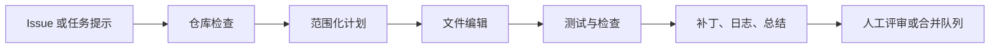

import SupportCTA from "/snippets/support-cta-zh-Hans.mdx";

<SupportCTA />

## 概述

编码智能体把一个软件任务变成有边界的实现循环：检查仓库、提出改动、
编辑正确文件、运行检查，并交付带验证说明的 diff。

当前的产品信号已经足够强，不应再把它视为“带聊天框的补全”。OpenAI 对
Codex 的当前定位同时覆盖云端软件工程智能体和本地终端编码智能体，这让
团队和个人构建者都能更清楚地理解这类工作流。

本周来源窗口给出的新经验是：编码智能体的质量不只取决于会不会生成代码，
还取决于 containment。也就是它能读取哪里、能执行什么、能访问哪些网络路
径，以及在用户建立信任边界之前，有多少不可信内容会流入它的上下文。

## 为什么这很重要

编码工作同时具备结构性和不确定性，因此很适合智能体，也很容易出错。

之所以有用，是因为它天然围绕产物展开：

- issue 文本或 bug 描述
- 仓库文件
- 测试与 linter
- patch diff
- review 评论

之所以有风险，是因为智能体可能在语气很自信的情况下仍然改错文件、漏掉
失败测试，或者越界修改不相关内容。

因此，比起“模型会不会写代码”，更关键的是边界是否明确。一个有用的编码
智能体应当是仓库范围内的 worker，并且带有显式验证，而不是一个泛化的
“帮我写点代码”的助手。

## 心智模型

一个耐用的编码智能体工作流通常有五步：

- `inspect`：先读 issue、仓库结构和附近代码，再决定是否改动
- `plan`：确定最小文件集合和验证路径
- `change`：在保留无关本地改动的前提下编辑目标文件
- `verify`：运行测试、linter 或聚焦命令来验证声称的修复
- `handoff`：总结 diff、剩余风险以及 reviewer 接下来该关注什么

关键的系统边界不是“模型是否会写代码”，而是运行时是否能让智能体停留在
目标仓库、工具和审批范围内，同时保留可读的审计轨迹。

## 架构图

## 工具版图

编码智能体通常需要组合这些能力：

- 用于读取代码、文档和配置的仓库访问
- 能产出可审查补丁的文件编辑工具
- 用于测试、格式化、构建和 git 检查的 shell 能力
- 当任务依赖当前文档或运行中的 UI 时的浏览器或网页访问
- 面向审批、网络访问和破坏性命令的 guardrails

OpenAI 当前的 Codex 表面比很多早期编码助手更清楚地暴露了这条分工线：

- 云端 Codex 将软件任务描述为各自独立的运行，每次运行都在 sandbox 环境
  中并预装仓库
- 开源的 Codex CLI 则把本地路径描述为一个终端编码智能体，具备 approval
  modes、MCP 访问、web search 和 cloud-task handoff

因此，编码智能体更适合被教授为一条端到端系统循环，而不只是模型输出质
量问题。

## Containment 边界

最近的一手资料把边界设计讲得更清楚了：

- `environment`：用 sandbox、VM、文件系统边界和 egress controls 来限制
  智能体真正能到达的范围
- `model`：用 prompts、confirmations 和其他 safeguards 来降低风险行为，
  但不要把它们当成完整防线
- `external content`：把仓库、MCP servers、tool output、复制进来的 prompt
  和抓取到的页面都视为不可信输入，因为它们都可能携带 prompt injection

对编码智能体来说，这意味着仅仅“有审批”还不够。Anthropic 当前的工程文档
把 containment 定义为 Claude.ai、Claude Code 和 Cowork 三类产品的 blast
radius 硬边界。OpenAI 当前的安全文档则从另一个角度说明了同一件事：prompt
injection 往往来自第三方内容进入上下文，结果可能是数据外泄或错位的工具调
用。MCP 的安全文档补上了协议层经验：工具与 scope 的授予应当逐步提升，并
保持 least-privilege。

实际结论很直接：评估编码智能体时，应把它看作一个有边界的运行时，而不是
一个单纯“带 shell 的模型”。

## Guardrails

对编码智能体来说，有用的默认做法包括：

- 从仓库检查开始，而不是立刻编辑
- 尽量缩小写入范围
- 尽量把 secrets、宿主机凭据和无关目录排除在可见 workspace 之外
- 默认关闭网络访问，只在某个具体任务确实需要时再提升权限
- 保留无关的 working-tree 改动
- 在宣称完成前要求显式验证
- 让命令输出、diff 和测试结果对 reviewer 可见
- 将 secrets、生产凭据和破坏性 git 命令视为单独审批边界
- 在边界明确之前，把仓库内容、项目本地配置、MCP tool output 和抓取到的
  网页都视为不可信输入

如果环境同时支持本地执行和云端执行，就要把信任边界讲清楚。本地执行能看
到开发者真实机器状态，但也会继承更多 secrets 与工作站风险。云端 sandbox
更容易隔离，但仍然需要明确的仓库、密钥和网络策略。

## 权衡

- 更高自治度能减少复制粘贴工作，但也会增加广泛误改的风险。
- 本地执行能看到真实仓库和环境，但会继承更多 secrets 与工作站风险。
- 云端 sandbox 更容易隔离，但如果依赖和 secrets 不一致，也可能偏离真实
  本地设置。
- 更强的模型能更早暴露不确定性和代码缺陷，但当智能体可以读取不可信内容
  或调用高权限工具时，它们仍然不能替代 containment。
- 快速生成 patch 看起来很高效，但更慢一点的 inspect 加 verify 循环通常会
  产生更好的改动。

实用默认做法：

- 用本地或云端编码智能体来检查、修改并验证
- 让人类保留 merge 决策权
- 优先追求可追踪的 diff 和可复现的检查，而不是一次性代码生成

## 当前产品信号

本次手册运行的当前七日信号是 `coding agent containment`。这个词是从已存
储文章中围绕 Anthropic containment 说明、Claude Opus 4.8 发布，以及面向
编码工作流的 prompt-injection 事件提炼出来的，再用当前的一手文档和公开
GitHub 仓库完成核实。

可复用的经验比某一家供应商更广：

- 编码智能体正在变成一个独立产品类别
- 最有效的形态是 repository-first、verification-heavy、approval-aware
- 下一层差异化在于 containment：workspace-only writes、范围化网络策略、
  受控的工具授权，以及对不可信内容的显式处理
- 团队应把它们作为带有 memory、tools、policies 和 review artifacts 的
  智能体系统来评估，而不是把它们当作纯 prompt UX

## 入门方向

如果你要一个最快的实践入口，可以先看现有的
[Codex 桌面智能体设置](/zh-Hans/workshops/desktop-agents/codex) 工作坊。它
是这个仓库里从安装走到真实仓库工作的最短路径。

然后再把本页连接到：

- [评估与可观测性](/zh-Hans/systems/evaluation-and-observability)，理解验
  证和轨迹循环
- [上下文工程](/zh-Hans/systems/context-engineering)，理解 instruction、
  state 和 retrieval 边界
- [Claude Code 桌面智能体设置](/zh-Hans/workshops/desktop-agents/claude-code)，
  查看一个把 sandbox 与 approval 选择显式化的本地编码智能体工作流
- [本地智能体工具 Source Map](/zh-Hans/contributor-kit/reference-notes/local-agent-tooling-source-map)，
  对照 roots、resources、connectors 与 file-grounded 边界设计
- [案例研究总览](/zh-Hans/case-studies)，对照 deep research 与客户支持
  等其他产品形态

## 引用

- 官方来源：[Introducing Codex](https://openai.com/index/introducing-codex/)
- 官方来源：[Codex CLI documentation](https://developers.openai.com/codex/cli)
- 官方来源：[How we contain Claude across products](https://www.anthropic.com/engineering/how-we-contain-claude)
- 官方来源：[Understanding prompt injections](https://openai.com/safety/prompt-injections/)
- 官方来源：[Safety in building agents](https://developers.openai.com/api/docs/guides/agent-builder-safety)
- 官方来源：[MCP security best practices](https://modelcontextprotocol.io/docs/tutorials/security/security_best_practices)
- 高信号仓库：[openai/codex](https://github.com/openai/codex)
- 高信号仓库：[modelcontextprotocol/modelcontextprotocol](https://github.com/modelcontextprotocol/modelcontextprotocol)
- 高信号仓库：[anthropics/claude-code-action](https://github.com/anthropics/claude-code-action)

## 延伸阅读

- [Codex 桌面智能体设置](/zh-Hans/workshops/desktop-agents/codex)
- [Claude Code 桌面智能体设置](/zh-Hans/workshops/desktop-agents/claude-code)
- [评估与可观测性](/zh-Hans/systems/evaluation-and-observability)
- [上下文工程](/zh-Hans/systems/context-engineering)
- [本地智能体工具 Source Map](/zh-Hans/contributor-kit/reference-notes/local-agent-tooling-source-map)
- [案例研究总览](/zh-Hans/case-studies)

## 更新日志

- 2026-05-31：围绕编码智能体的 containment 边界、prompt-injection 风险和
  更强的一手来源链接刷新本案例研究，覆盖 Codex、Claude Code、OpenAI
  安全文档与 MCP 安全文档。
- 2026-05-03：新增一个 repo 原生的编码智能体案例研究，用当前 OpenAI
  Codex 信号锚定，并与仓库现有的 Codex 工作坊互相链接。
