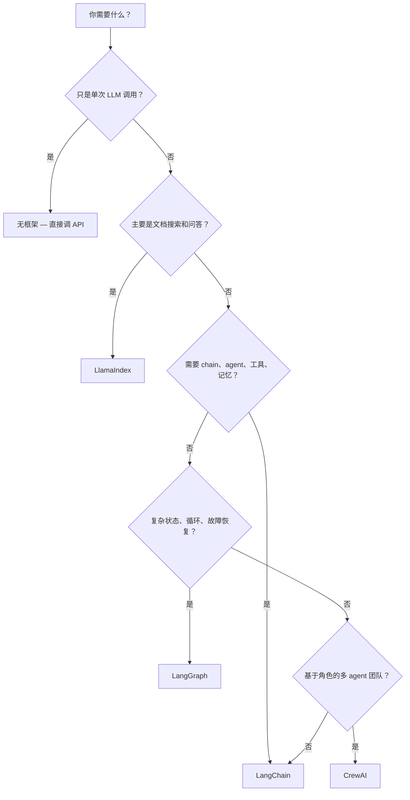
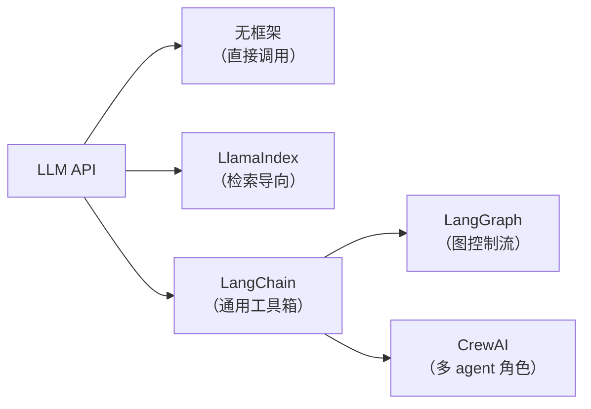

import SupportCTA from "/snippets/support-cta-zh-Hans.mdx";

<SupportCTA />

## 摘要

LangChain、LlamaIndex 等 AI 框架将常见的 LLM 管道工作——提示词管理、工具调用、
记忆、检索——封装起来，让开发者不必为每个项目重复造同样的轮子。本页面帮助初学者
判断是否需要框架，以及如果需要，该选哪个。

## 为什么这很重要

直接调用 LLM API 对于单次提示-响应脚本来说已经足够。但当项目需要以下任何能力时，
样板代码就开始膨胀：

- **多轮对话记忆**
- **基于私有知识库的文档检索**
- **工具调用**，如网络搜索或数据库查询
- **多步推理**，一次 LLM 调用的输出作为下一次的输入
- **多智能体协调**，多个专家角色协作完成任务

框架吸收了这些样板代码。没有框架的话，团队最终会维护手写版本的相同抽象——而这些
手写版本往往会漂移、崩溃，且难以测试。

另一面的风险是**过度工程化**。当一个十行脚本就能搞定的时候，引入重型框架只会增加
学习成本、依赖负担和调试难度，却没有回报。正确的问题不是"哪个框架最好？"而是
"我当前的痛点是否值得引入一个框架？"

## 心智模型

把这些框架选择光谱想象成用**乐高积木与说明书**进行拼装的不同方式：

| 选项 | 乐高类比 | 含义 |
| --- | --- | --- |
| **无框架** | 散装的基础积木，没有任何拼装说明书 | 直接调用 LLM API。拥有 100% 的自由度，没有任何预设抽象，最大灵活性——但你需要自己亲手拼装每一个连接处和边界逻辑。 |
| **LlamaIndex** | 专门用来拼装“收纳盒”或“图书架”的特定乐高套件 | 配备了最适合存放和检索的专用积木以及极度优化的专属图纸。专为将 LLM 连接到你的私有文档（数据摄入、索引与检索）而生，在 RAG 领域极其高效，但并不适合用来拼智能赛车。 |
| **LangChain** | 包含海量齿轮、底板、人仔的“乐高经典（Classic）全家桶” | 一个通用的工具箱。它提供了现成的常用功能模块（如 Chain、提示词模板、工具连接器、多语境记忆），你不用重复制造最基础的零件，但需要自己按照图纸把它们组合起来。 |

两个高级扩展：

- **LangGraph** — 可以理解为**乐高科技系列（Technic）或可编程机器人（Mindstorms）**。它引入了齿轮组、马达和可编程控制器，允许你构建带循环往复、状态保存、条件分支的复杂动态机器（对应复杂的图控制流与循环代理逻辑）。
- **CrewAI** — 专门用于团队作战的**“角色扮演套件”**。每个乐高小人都有自己的人设（角色、目标和背景故事），它们在一套明确的协作任务说明书下共同完成一项复杂的任务。

关键洞察：**只有当"没有这个抽象"的痛苦超过了"引入它"的成本时，才往上走一层。**

## 架构图

各选项相对于原始 LLM API 的位置简图：

## 工具生态

### 对比表格

| 维度 | 无框架 | LlamaIndex | LangChain | LangGraph | CrewAI |
| --- | --- | --- | --- | --- | --- |
| **用途** | 直接调用 LLM，完全手动控制 | 文档摄入、索引和问答 | 通用 LLM 应用工具箱 | 有状态的图编排 | 基于角色的多智能体协作 |
| **复杂度** | 最低 | 低–中 | 中–高 | 高 | 中 |
| **最适合** | 脚本、演示、学习 | RAG 管道、知识库 | 聊天机器人、使用工具的 agent、chain | 有循环和检查点的复杂工作流 | 天然映射到专家团队的场景 |
| **学习曲线** | 无（只需了解 API） | 小——聚焦的 API 表面 | 较陡——抽象概念多 | 陡——需要图思维 | 中等——角色/任务模型直观 |
| **何时避免** | 超出玩具脚本的任何场景 | 检索不是核心问题时 | 简单 API 调用就够时 | 工作流是线性时 | 只有单个 agent 时 |

### 场景演练

#### 场景 1 — 简单聊天机器人

- **无框架**：调用 chat completion API，用列表管理消息历史，手动处理 token
  限制。做原型够用。
- **LangChain**：使用 `ChatOpenAI` + `ConversationBufferMemory`，开箱即获
  记忆管理、提示词模板和流式输出。
- **结论**：先不用框架；当记忆管理或工具调用变得痛苦时再切换到 LangChain。

#### 场景 2 — 基于内部 PDF 的文档问答

- **无框架**：自己写 PDF 解析器、文本分块、调用 embedding API、存向量、检索、
  组装提示词。工作量大。
- **LlamaIndex**：用内置 reader 加载文档，创建向量索引，查询。几行代码搞定。
- **LangChain**：也可以通过其 retrieval chain 抽象实现，但比 LlamaIndex
  需要更多胶水代码。
- **结论**：当检索是核心任务时，LlamaIndex 是天然之选。

#### 场景 3 — 多智能体研究工作流

- **LangGraph**：定义一个图，其中 planner 节点委派任务给 researcher 和 writer
  节点，带条件边和检查点。
- **CrewAI**：定义带角色（researcher、writer、editor）和任务的 agent，让框架
  处理委派。
- **结论**：两者都可以；CrewAI 原型更快，LangGraph 对执行流的控制更精细。

## 权衡

- **无框架** 提供完全控制，但扩展性差。每个新功能都意味着更多手写代码。
- **LlamaIndex** 擅长检索，但不是通用 agent 框架。如果你需要的工具、记忆或
  多步 chain 超出了 RAG 范畴，你会很快超出它的能力边界。
- **LangChain** 覆盖面最广，但其抽象深度可能让调试更难、升级更贵。
- **LangGraph** 为复杂状态机增加了能力，但引入的图概念对线性工作流来说是大材小用。
- **CrewAI** 让多 agent 设置变得直观，但隐藏了编排细节，对需要自定义控制流的
  场景可能是限制。

有用的默认原则：

- 从无框架开始。只有痛点真实存在时才往上走。
- 问题是"搜索我的文档"时，选 LlamaIndex。
- 问题是"构建一个使用工具的 agent"时，选 LangChain。
- 问题涉及协调的多步骤或多智能体工作时，选 LangGraph 或 CrewAI。
- 如果任务足够确定性，用普通函数或工作流——不要用 agent。

## 引用

- [LangChain 文档](https://python.langchain.com/)
- [LlamaIndex 文档](https://docs.llamaindex.ai/)
- [LangGraph 文档](https://langchain-ai.github.io/langgraph/)
- [CrewAI 文档](https://docs.crewai.com/)
- 当前官方阅读材料列在 `external_readings` 中。

## 延伸阅读

- [智能体框架](/zh-Hans/ecosystem/agent-frameworks)：中级水平的框架对比，涵盖
  以对话为先、以图为先、以 skill 为先和以工程为先的框架。
- [智能体运行时构建模块](/zh-Hans/patterns/agent-runtime-building-blocks)：
  框架封装的运行时基元。
- [生态概览](/zh-Hans/ecosystem)：完整的生态板块。

## 更新日志

- 2026-05-04：面向初学者的框架对比初稿。
