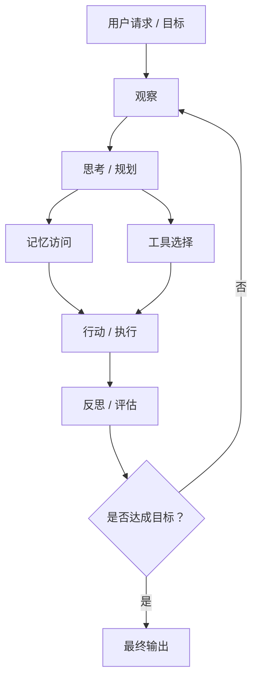

import SupportCTA from "/snippets/support-cta-zh-Hans.mdx";

<SupportCTA />

## 概要

**智能体（Agent）**是一个以目标为导向的系统，它能够持续地感知环境、进行决策，并采取行动以实现预期结果。与静态模型不同，智能体本质上是一个不断运行的循环系统——在动态环境中反复进行“观察—思考—行动”的过程，并根据变化不断调整自身行为。在本节中，你将理解智能体与单一模型的区别，掌握这一感知—决策—行动循环如何构成智能行为的核心，以及这类系统在实际中的设计方式与应用场景。

## 为什么这很重要

传统程序和单一模型本质上是受限的：它们要么执行预先定义的逻辑，要么只产生一次性的输出，缺乏持续适应环境、长期运行和自主完成目标的能力。智能体的重要性在于，它将“静态计算”转变为“持续的、以目标为驱动的行为”。

自治性（Autonomy）减少了对人工干预的依赖，使系统能够在动态环境中独立运行；工具使用（Tool Use）突破了单一模型的能力边界，使系统可以调用外部工具、访问数据并执行实际操作；而最关键的是，智能体的循环机制——持续进行“感知—决策—行动”的过程，使其能够处理那些无法通过一次计算完成的复杂、多步骤任务。

从本质上看，智能体代表了一种范式转变：从“执行一次”的系统，走向“持续行动、动态适应并不断改进”的系统。理解这一转变，是构建真正实用、可扩展且能够应对现实复杂性的智能系统的关键。

## 心智模型

智能体的核心是一个**闭环决策系统**，而不是一次性的计算过程。与线性流程不同，智能体通过一个持续运行的循环来工作：

**感知（Observe）→ 思考（Think）→ 行动（Act）→ 反思（Reflect）→ 循环（Loop）**

* **感知（Observe）**：通过用户输入、传感器数据或外部信息获取环境状态
* **思考（Think）**：利用模型（如大语言模型）、规则或规划方法，对信息进行分析并决定下一步行动
* **行动（Act）**：执行具体操作，例如调用工具、生成结果或与环境交互
* **反思（Reflect）**：根据执行结果进行评估，引入反馈、错误信息或新数据，对后续行为进行调整

这一过程不断重复，形成一个**自我修正、持续适应的循环系统**。

最关键的一点是：智能体并不是由某一次决策或响应定义的，而是由这一持续运行的过程所定义。它的智能来源于不断迭代和优化行为的能力。换句话说，智能体本质上是一个**持续运行的闭环系统，而不是一次函数调用**。

---

### 示例：每日新闻观察者（Daily News Watcher）

假设有一个用于生成每日新闻摘要的智能体：

* **感知（Observe）**：接收用户请求（例如“总结最新的AI新闻”），并从多个数据源获取文章
* **思考（Think）**：判断哪些文章相关，进行主题筛选，并决定内容组织方式
* **行动（Act）**：抓取、解析并总结选定文章，生成结构化报告
* **反思（Reflect）**：评估结果是否完整、连贯，如有必要进行调整

这一过程形成一个循环，使智能体能够根据中间结果不断优化输出。

---

### 与传统脚本的区别

虽然整体流程看起来类似于一个脚本化流水线，但智能体在本质上有明显不同：

* **动态决策（Dynamic decision-making）**
  传统脚本按照固定步骤执行；
  智能体会根据中间结果动态决定下一步操作（例如筛选哪些文章、如何总结）。

* **基于上下文的推理（Context-aware reasoning）**
  脚本依赖预设规则；
  智能体能够理解输入语义（如“最新AI新闻”），并据此调整行为。

* **灵活的控制流程（Flexible control flow）**
  脚本流程是静态的；
  智能体可以根据结果进行循环、修正或分支（例如结果不够好时重新抓取或总结）。

* **语言智能驱动（Integration of language intelligence）**
  脚本主要处理结构化数据；
  智能体利用模型处理非结构化数据（如文本），实现总结、筛选与推理。

## 架构图

## 工具版图

现代智能体并不是由单一模型构成，而是一个由多个组件协同工作的系统化结构。正是这种模块化设计，使智能体能够超越简单响应，处理复杂的现实任务。
* **LLM（推理核心）**：负责理解输入并决定下一步行动
* **工具（Tools，执行层）**：扩展能力，使系统能够与外部环境交互并执行操作
* **记忆（Memory，上下文层）**：提供跨步骤的信息连续性，实现上下文保持与自适应
* **框架（Framework，编排层）**：组织并协调各组件构成完整系统（如 LangChain、AutoGen）

一个有帮助的理解方式是：可以将LLM类比为“大脑”，工具类比为“四肢”。在此基础上，后端系统则类似于一种“神经系统”：它并不进行真正的生物信号传递，而是负责解析模型输出，将其映射为结构化的函数调用参数，并通过程序逻辑驱动工具执行。这一层正是实现从“决策”到“行动”转化的关键。

从本质上看，现代智能体并不是一个模型，而是一个多组件协同运作的系统——其智能来源于推理、工具、记忆与控制逻辑之间的协同作用。

## 权衡取舍

尽管智能体具备强大的能力，但这些特性也伴随着一定的代价。

* **循环带来的成本（延迟 / Token / 复杂度）**：
  持续的“感知—思考—行动”循环会带来更高的延迟和更多的Token消耗。多步骤推理、重试和反思机制也会增加系统复杂度，使性能优化和成本控制更加困难。

* **自主性带来的风险（错误或不当行动）**：
  更高的自主性减少了人工干预，但也意味着智能体可能做出错误决策、执行不安全操作，或误解目标，尤其是在开放环境中。

* **工具依赖（系统稳定性问题）**：
  智能体依赖外部工具和API来执行任务。一旦这些依赖出现问题（如接口报错、延迟波动或结果不稳定），就会直接影响智能体的行为和整体系统的稳定性。

从本质上看，使智能体强大的这些特性——循环、自主性和工具使用——同时也引入了**成本、风险和工程复杂度**，需要在实际系统中进行权衡与控制。

## 引用

- Agent领域奠基综述
- LLM Agent时代代表综述

## 延伸阅读

- 下一篇：[1.3 智能体系统是什么](/zh-Hans/foundations/agent-systems/what-is-agent-system)
- [智能体 vs 工作流](/zh-Hans/foundations/agents-vs-workflows)
- [智能体记忆与检索](/zh-Hans/patterns/agent-memory-and-retrieval)
- [基础知识概览](/zh-Hans/foundations)

## 更新日志

- 2026-04-20: 初始框架建立。
- 2026-05-04：完成核心内容，包括定义、心智模型、工具生态、权衡分析、示例与参考文献

