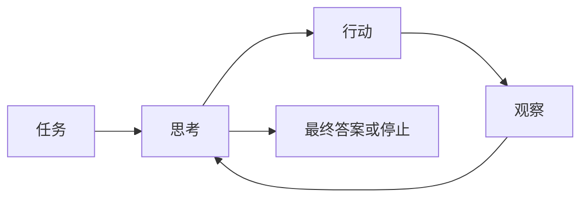

import SupportCTA from "/snippets/support-cta-zh-Hans.mdx";

<SupportCTA />

## 概要

推理与控制模式定义了一个智能体如何在思考、行动和停止之间切换。它们更关注系统如何随时间组织决策，而不是模型本身有多智能。如今，这种结构已经不只是一条单一循环：还包括在单个会话里调用工具的主循环、由主会话委派 side task 的 subagent，以及多个 specialist 并行协作的 multi-agent orchestration。

## 为什么这很重要

两个接入同一模型和工具的智能体，可能会因为控制模式不同而表现得非常不一样。一个可能高效搜索，另一个则可能循环、产生幻觉，或者在错误的时间调用错误的工具。

因此，模式选择会影响：

- 行动质量
- 可解释性
- 成本和延迟
- 恢复行为
- 系统是否值得承担额外的协调开销

## 心智模型

导入的参考材料使用 ReAct 作为最清晰的基线。它的核心思想很简单：

- 思考当前状态
- 执行一个动作
- 观察结果
- 重复

这种设计之所以强大，是因为推理和行动会彼此纠正。它在系统需要外部信息或工具执行才能继续时尤其有用。

更广泛的结论是，控制模式定义了推理发生在什么位置：

- 在行动之前
- 在行动之间
- 在失败之后
- 或在明确的停止点

同样的结论也适用于 orchestration。系统还要决定协调发生在什么位置：

- 在一个 agent loop 内部
- 通过向 side worker 委派并由主会话回收结果
- 或通过多个独立 agent 之间的直接协作

## 架构图

## 如何选择控制表面

Anthropic 近期的官方材料让这类选择更清楚了：

| 如果工作更像…… | 更适合…… | 因为…… |
| --- | --- | --- |
| 一串顺序执行的工具调用，而且每一步结果都会改变下一步 | 单会话循环 | 成本最低，也最容易调试 |
| 一个会把主上下文塞满日志、搜索结果或文件内容的聚焦 side task | subagent 委派 | 主会话仍然掌控任务，worker 只回传摘要 |
| 需要多个 specialist 同时沿不同方向调查 | multi-agent orchestration | 不同 worker 可以并行推进 |
| worker 之间需要直接讨论、共享任务、彼此协调 | agent teams 或协作式 multi-agent 模式 | 这类工作不适合只做单向回报 |

真正的问题不只是“模型够不够聪明”，还包括“相对于并行或专业分工带来的收益，协调成本是否值得”。

## 工具格局

常见的推理与控制模式包括：

- 逐步思考-行动-观察循环，适用于开放式工具使用
- 带保护的工具选择，其中动作受到狭窄接口的约束
- 明确的停止或交接规则，防止无限循环
- 可追踪的推理表面，暴露足够的中间状态以调试决策，而不必把每个 token 都强制纳入最终答案
- 分层式 orchestration，由 supervisor、router 或 orchestrator 将任务分发给不同 specialist
- 协作式 multi-agent 模式，worker 之间可以直接通信，或通过共享状态协作，而不是一切都经由单一 lead 转发

关键的设计选择不是要不要展示 chain-of-thought，而是系统是否拥有足够的内部控制结构，能够让行动保持目的性，并在证据变化时恢复。

Anthropic 当前给出的控制表面划分在实践里很有用：

- `subagents` 适合在单个会话里处理聚焦 side work。它们有自己的上下文窗口，但只向主 agent 回报结果。
- `agent teams` 适合更昂贵、也更协作式的任务：多个独立会话需要直接通信、共享 task list，并显式协同。
- `multi-agent orchestration` 是更大的架构范畴，涵盖 supervisor 模式、分布式协作模式，以及两者混合的结构化工作流。

## 权衡

- 逐步循环具有适应性，但比直接执行更慢，而且如果没有强有力的停止条件，可能会偏离。
- 高可解释性的控制表面更易于调试，但也可能显得冗长且成本更高。
- 窄工具表面可以减少错误，但也可能限制灵活性。
- 丰富的中间推理可以改善决策，但前提是系统能够让这些推理与实际任务保持一致。
- multi-agent orchestration 可以提升覆盖面和专业分工，但 token、延迟和 observability 成本也会迅速上升。
- 协作式 worker 团队只在任务真的能并行时才值得；如果任务本质上是顺序的，或者多个 worker 会编辑同一处文件，协调开销很容易反过来压过收益。

有用的默认策略：

- 当工具反馈会改变下一个最佳动作时，优先使用逐步控制
- 在增加更多工具广度之前，先添加明确的停止条件
- 保持控制循环足够可检查，以便调试，即使最终产品会隐藏其中大部分内部机制
- 如果一个 lead 仍然可以拥有任务，只是需要一些聚焦 side result，优先用 subagent，再考虑 agent teams
- 只有在专业分工或并行推进确实明显优于单循环设计时，才引入 multi-agent orchestration

## 引用

- 来源输入：[Chapter 4 Building Classic Agent Paradigms](https://github.com/datawhalechina/Hello-Agents/blob/main/docs/chapter4/Chapter4-Building-Classic-Agent-Paradigms.md)
- 来源输入：[Hello-Agents upstream repository](https://github.com/datawhalechina/Hello-Agents)
- 官方来源：[Anthropic: Building Effective AI Agents](https://resources.anthropic.com/hubfs/Building%20Effective%20AI%20Agents-%20Architecture%20Patterns%20and%20Implementation%20Frameworks.pdf)
- 官方来源：[Claude Code subagents](https://code.claude.com/docs/en/sub-agents)
- 官方来源：[Claude Code agent teams](https://code.claude.com/docs/en/agent-teams)

## 延伸阅读

- [Planning And Reflection](/zh-Hans/patterns/planning-and-reflection)
- [Protocols And Interoperability](/zh-Hans/systems/protocols-and-interoperability)
- [Patterns Overview](/zh-Hans/patterns)

## 更新日志

- 2026-05-07：补充 Anthropic 当前关于 subagents、agent teams 与 multi-agent orchestration 的官方控制表面指导。
- 2026-04-21：基于导入的参考材料和实验室重写规则的首次仓库原生草稿。
